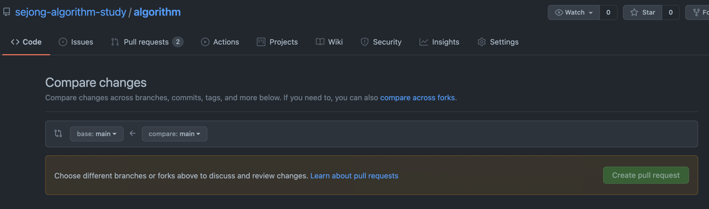

# 🌻 Commit Message 규칙
1. 커밋 이전에 먼저 `upstream` repository 와 동기화를 시켜주세요.   
   

    $ git pull upstream main


2. 커밋 메시지는 ```[문제 출처 사이트] 문제 번호 : 문제 이름 ``` 로 해주세요.
   

      $ git commit -m [BOJ] 12345 : Moist (Small2)

# 🌻 Pull Request 규칙
1. fork 한 개인 repository 에서 upstream repository의 `main` 브랜치로 pull request 를 해주세요.
   
    - `compare across forks` 를 누릅니다.
    - 본인 repo가 `compare`, upstream repo가 `base`로 위치하게 선택
    - `create pull request` 를 눌러주세요.
          
2. pull request 메시지는 개인의 자유이나 웬만하면 commit message 와 동일하게 해주세요.
3. 규칙이 맞다면 하루 이내에 pull request 가 수락됩니다. (규칙과 맞지 않으면 반려될 수 있습니다.)